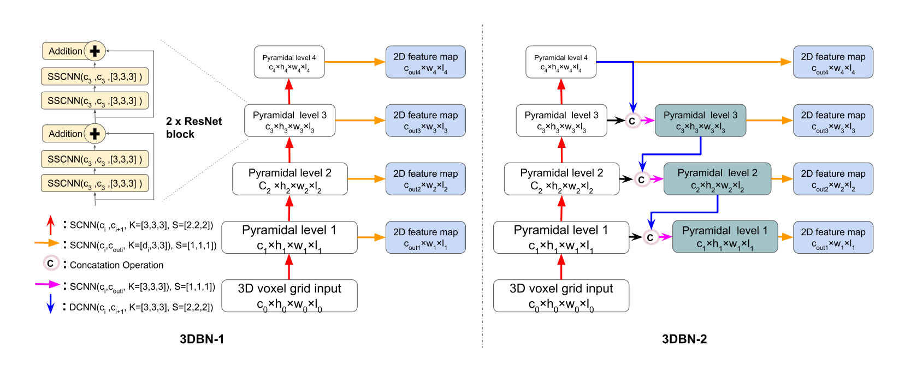

# 3DBN
This repository contains the python implementation of 3D Backbone Network for 3D Object Detection

Pipeline



# Install
Implemented and tested on Ubuntu 16.04 with Python 3.6 and Pytorch 1.0.
1. Clone the repo
```bash
git clone https://github.com/Benzlxs/tDBN.git
```

2. Install Python dependencies
The miniconda3 package manager package is recommended.
```bash
cd ./tDBN
pip3 install -r requirements.txt
```

3. Install Pytorch. 
Visiting pytorch official [webpage](https://pytorch.org/get-started/locally/) and installing 1.0 version PyTorch according to your hardware configuration.
```bash
conda install pytorch torchvision cudatoolkit=9.0 -c pytorch
```
4. Install [SparseConvNet](https://github.com/traveller59/SparseConvNet) according to its README file.

5. Compile the protos.
```bash
cd ./tDBN
bash protos/run_protoc.sh
```

# Dataset
1. Downlaoad the [KITTI](http://www.cvlibs.net/datasets/kitti/eval_object.php?obj_benchmark=3d) and arrange files as following:
```plain
kitti_dataset
        training
                image_2
                label_2
                calib
                velodyne
                velodyne_reduced
        testing
                image_2
                calib
                velodyne
                velodyne_reduced
```
2. Split dataset and put them under the folder, `./tDBN/kitti/data_split`, we provide the two set of data split, 50/50 split or 75/25 split, or you can customize your data split ratio.
 
3. Create kitti dataset infos:
```bash
cd ./tDBN
python ./scripts/create_data.py create_kitti_info_file --data_path=kitti_dataset
```

4. Create reduced point cloud:
```bash
cd ./tDBN
python ./scripts/create_data.py create_reduced_point_cloud --data_path=kitti_dataset
```

5. Create groundtruth database:
```bash
cd ./tDBN
python ./scripts/create_data.py create_groundtruth_database --data_path=kitti_dataset
```

6. Modify the directory in config file
Go to the config folder and configurate the `database_info_path`, `kitti_info_path` and `kitti_root_path` to your path.


# Training
1. Select your config file and output directory in `train.sh`, like setting `config`=`./configs/car_tDBN_bv_2.config`
2. Start to train:
```bash
cd ./tDBN
bash train.sh
```
3. Training results are saved in output directory, check the `log.txt` and 'eval_log.txt' for detailed performance.
4. Some training results are as following
```
Eval_at_125571
Car AP@0.70, 0.70, 0.70
3D  AP 87.98, 77.89, 76.35
Eval_at_160940
Car AP@0.70, 0.70, 0.70
3D  AP 88.20, 77.59, 75.58
```


# Evaluate and inference
1. Select your config file and output directory in `train.sh`, like setting `config`=`./configs/car_tDBN_bv_2.config` 
2. Set the model path that you want to evaluate, `ckpt_path`
3. If you want to evlaute, set `test=False`, if you want to generate testing result, set `test=True` and ` kitti_info_path=your_kitti_dataset_root/kitti_infos_test.pkl`
4. Start to evaluate or inference:
```bash
cd ./tDBN
bash evaluator.sh
```
5. Testing results on [KITTI benchmark](http://www.cvlibs.net/datasets/kitti/eval_object.php?obj_benchmark=3d).
```
Benchmark	Easy	Moderate	Hard
Car (Detection)	90.30 %	88.62 %	80.08 %
Car (Orientation)	89.93 %	87.95 %	79.32 %
Car (3D Detection)	83.56 %	74.64 %	66.76 %
Car (Bird's Eye View)	88.13 %	79.40 %	77.97 %
```
<!---
6. Use pretrained model
If you don't want to train your own model, we also provide some [pretrained model](https://www.dropbox.com/sh/91fl39566elgwzi/AABqz1S_LJInu72NhPKOjYYDa?dl=0).
--->

# Acknowledge
Thanks to the team of [Yan Yan](https://github.com/traveller59) , we have benifited a lot from their previous work [SECOND](https://github.com/traveller59/second.pytorch).


